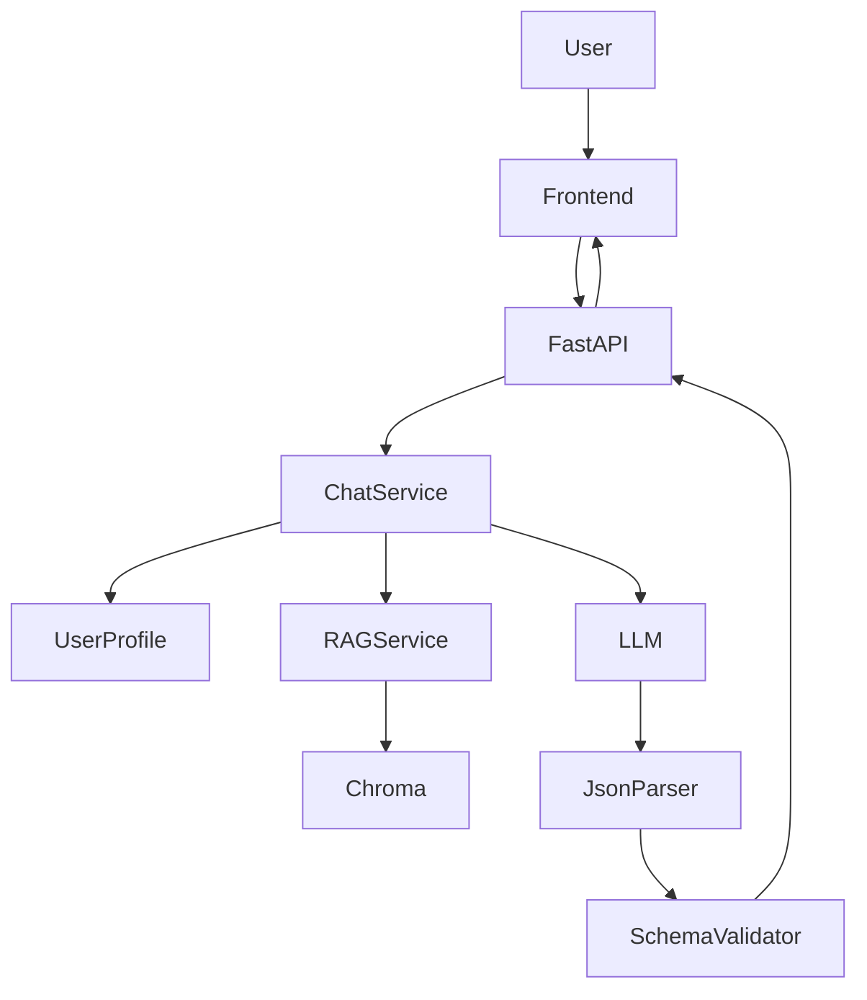

# 系统架构

## 总览

本项目是一个 **RAG + LLM** 的对话式菜谱推荐系统：

- 前端：`frond/`（Taro 3 + React + TS）
- 后端：`backend/`（FastAPI + Chroma + OpenAI 兼容接口）

## 分层（Backend）

遵循 PRD 的分层规则（API → Service → AI → Data）：

- **API Layer**：`backend/app/api/*`（路由、参数校验、依赖注入）
- **Service Layer**：`backend/app/services/*`（业务编排：画像、记忆、收藏）
- **AI Layer**：`backend/app/ai/*`（RAG 检索、Prompt、LLM 调用、JSON 解析与 schema 校验）
- **Data Layer**：`backend/app/data/*`（sqlite ORM、Chroma 持久化、seed 数据）

## 数据流（/chat）

1. 前端发送 `POST /chat`（`user_id`、`message`）
2. 后端 `chat_service`：更新用户画像（轻量抽取）、写入对话记忆
3. `rag_service`：从 Chroma 检索候选菜谱（RAG 优先）
4. `chat_ai`：拼接 prompt → 调 LLM → 提取 JSON → Pydantic schema 校验 → 失败重试 1 次 → fallback
5. 返回 `reply` + `recipes[]` 给前端渲染卡片

